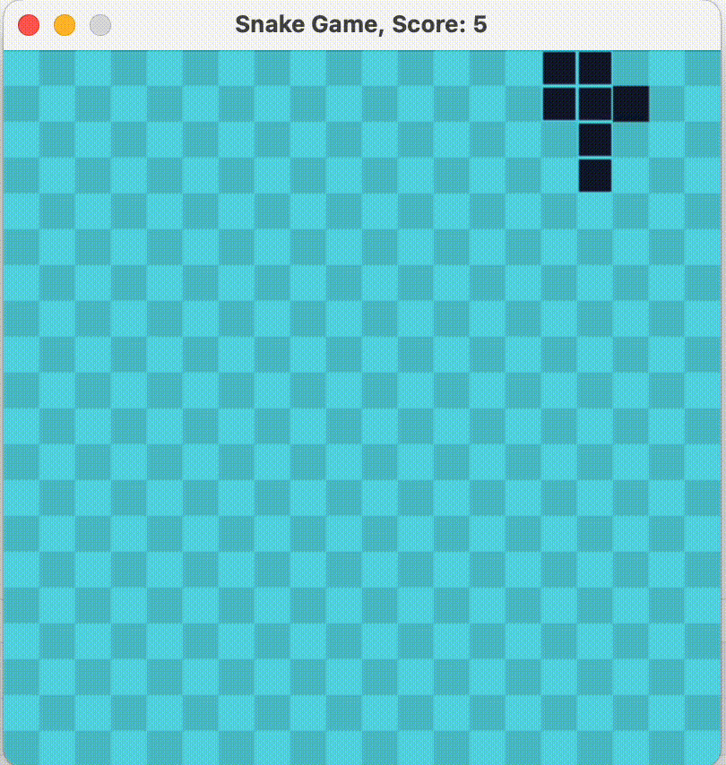

# Reinforcement Learning with Snake Game

    

## Introduction
This project trains the Q-learning agent using the vanilla q-learning algorithm. 
- `agent.py`: Q-learning agent class
- `game.py`: Game class
- `main.py`: The main program for training the Q-learning agent using Bellman's equation

To run this project, please make sure you have installed the package listed inside `requirements.txt`.
You can test-run the program by running the `test-script.py`. Pickle files are stored inside the `pickles` folder.

Enjoy :smile:
